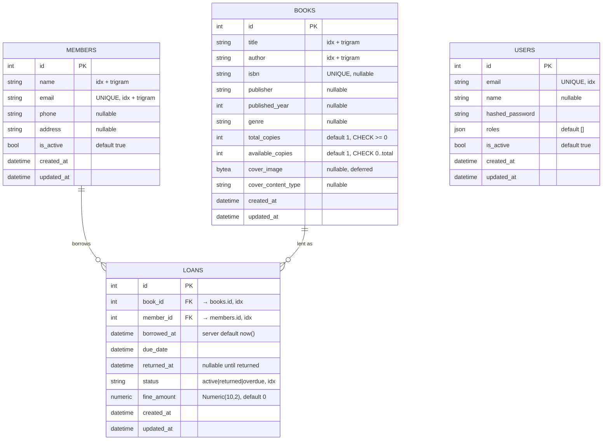

# Database Schema

PostgreSQL 16 via SQLAlchemy 2.0. Four tables: three library-domain tables
(`members`, `books`, `loans`) plus a standalone `users` table for staff auth.

Source of truth: the ORM models under `app/api/v1/*/models.py`. This doc is generated
from them — regenerate when models change. All tables inherit `created_at` / `updated_at`
from `TimestampMixin` (`app/core/database/postgres.py`).

## Entity-Relationship Diagram



> `USERS` is intentionally detached — staff accounts authenticate the API but are not
> foreign-keyed to library operations. Loans are recorded against `members`, not staff
> `users`.

## ASCII view

```
   members                         books
   ───────                         ─────
   id            PK                id               PK
   name          (idx,trgm)       title            (idx,trgm)
   email   UNIQUE (idx,trgm)      author           (idx,trgm)
   phone                          isbn       UNIQUE (nullable)
   address                        publisher
   is_active                      published_year
   created_at                     genre
   updated_at                     total_copies     CHECK >= 0
        │                         available_copies CHECK 0..total
        │ 1                       cover_image      (bytea, deferred)
        │                         cover_content_type
        │                         created_at
        │                         updated_at
        │                              │ 1
        │ N                            │ N
        └──────────► loans ◄───────────┘
                     ─────
                     id          PK
                     book_id     FK → books.id   (idx)
                     member_id   FK → members.id (idx)
                     borrowed_at (default now())
                     due_date
                     returned_at (nullable)
                     status      active|returned|overdue (idx)
                     fine_amount Numeric(10,2)
                     created_at
                     updated_at

   users  (standalone — staff auth, no FK into the domain)
   ─────
   id PK · email UNIQUE · name · hashed_password · roles(json) · is_active · timestamps
```

## Relationships & rules

- `members` 1 ── N `loans`  — a member can have many loans.
- `books`   1 ── N `loans`  — a title is lent many times across its copies.
- `loans` is the junction carrying lending state (dates, status, fine).
- **Inventory:** borrowing decrements `books.available_copies`; returning increments it.
  Borrow/return mutate the loan row + the book row in one committed transaction.

### Constraints enforced in the DB
- `books`: `total_copies >= 0`, `available_copies >= 0`, `available_copies <= total_copies`
  (three `CHECK` constraints).
- `members.email`, `books.isbn`, `users.email`: `UNIQUE`.
- `loans.book_id`, `loans.member_id`: foreign keys, both indexed.

### Indexes worth noting
- Trigram GIN indexes (`pg_trgm`) on `books.title`, `books.author`, `members.name`,
  `members.email` for fuzzy search.
- B-tree indexes on `loans.status`, `loans.book_id`, `loans.member_id` for the
  filter-by-status and per-member/per-book loan queries.

---

## Future Schema Enhancements

Grouped by theme; each notes the table(s) touched and why. None are required for the
current feature set — they are paths the schema can grow along.

### 1. Loan integrity & lifecycle
- **Partial unique index "one active loan per copy"** — prevent double-lending the same
  physical copy. Requires modeling copies first (see #5), then
  `UNIQUE (book_copy_id) WHERE returned_at IS NULL`.
- **`renewals` / `renewal_count` on `loans`** — track extensions to `due_date` and cap
  how many times a loan can be renewed.
- **`loan_events` audit table** — append-only log (`borrowed`, `renewed`, `returned`,
  `marked_overdue`, `fine_assessed`) instead of overloading `status`. Gives full history
  and makes the Celery overdue job idempotent.
- **Enum type for `loans.status`** — replace the free-text `String(20)` with a Postgres
  `ENUM`/`CHECK` to forbid invalid states at the DB layer.
- **`fine_paid` / `fine_paid_at`** — distinguish "fine accrued" from "fine settled";
  today `fine_amount` conflates both.

### 2. Members
- **Borrowing limits** — `max_active_loans` per member (or per membership tier), enforced
  in `borrow_book`.
- **`membership_date` / `membership_expiry`** — the CLAUDE.md data model mentions
  `membership_date`, but the live model doesn't have it; add it plus an expiry for
  renewals.
- **Member tiers / `membership_type`** — a small `membership_plans` table (loan limits,
  loan duration, fine rate) FK'd from `members`, so policy is data not code.
- **Soft delete / GDPR** — `deleted_at` + anonymization path rather than hard deletes,
  since `loans` reference members historically.

### 3. Books & catalog
- **Physical copies table (`book_copies`)** — split bibliographic data (`books`) from
  physical inventory (`book_copies`: barcode, shelf location, condition, acquired_at).
  `loans` would then FK a specific copy, replacing the `total/available_copies` counters
  with real rows. This is the single biggest structural upgrade and unblocks #1, holds,
  and per-copy condition tracking.
- **Categories / tags many-to-many** — `genre` is a single free-text column; a
  `categories` table + `book_categories` join enables multi-genre and clean filtering.
- **Authors as entities** — `authors` table + `book_authors` join for multi-author books
  and author pages, instead of the single `author` string.
- **Move cover images out of the row** — `cover_image` as `bytea` bloats the table and
  TOAST; store covers in S3/CloudFront (already in the stack) and keep only a
  `cover_url` / `cover_key`.

### 4. Reservations & notifications
- **`reservations` / holds table** — let members reserve a checked-out title and get
  notified when a copy frees up (queue position, expiry).
- **`notifications` table** — persist overdue reminders / hold-ready messages the Celery
  worker sends, with delivery status, instead of fire-and-forget.

### 5. Fines & payments
- **`fine_transactions` table** — itemized accrual + payment ledger (amount, reason,
  loan_id, paid_at, method) so totals are auditable and partial payments are possible.
- **Configurable fine policy in DB** — daily rate, grace period, and max fine as rows
  (per membership tier) rather than a single config constant.

### 6. Cross-cutting / operational
- **Optimistic locking** — add a `version` column (SQLAlchemy `version_id_col`) to
  `books`/`loans` so concurrent inventory updates fail loudly instead of relying solely
  on row locks.
- **`created_by` / `updated_by`** — FK loans (and edits) to the staff `users` who
  performed them, giving the currently-detached `users` table a real link into the domain
  for accountability.
- **Full-text search** — promote the trigram setup to a `tsvector` column + GIN index on
  `books` for ranked title/author/description search.

### Suggested sequencing
1. `book_copies` (unblocks the most) → 2. `loan_events` + status enum →
3. fines ledger → 4. reservations/notifications → 5. categories/authors normalization.
Each is an additive Alembic migration; none requires a destructive rewrite of existing
tables.
